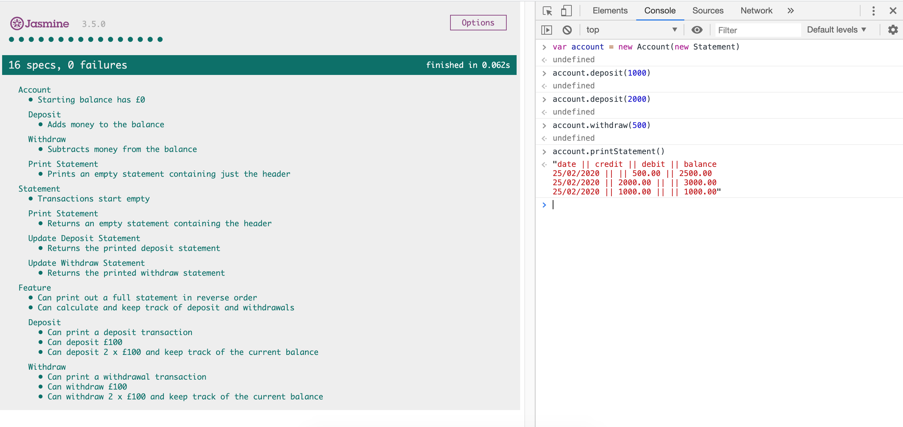

# Bank Tech Test

This is a simulation tech test. It was made to mimic a real life test of what one could expect from a junior development role. It functions as a small banking app which keeps track The specification is as follows: 

__Requirements:__
- You should be able to interact with your code via a REPL like IRB or the JavaScript console. (You don't need to implement a command line interface that takes input from STDIN.)
- Deposits, withdrawal.
- Account statement (date, amount, balance) printing.
- Data can be kept in memory (it doesn't need to be stored to a database or anything).

__Code Structure:__
- The code is split accross two constructors, the first 'Account' and the second 'Statement'. The Account constructor takes care of adding and subtracting the user input (deposit and withdraw) from the balance of the account. The Statement constructor then deals with adding a statement line (containing the user inout fro the account). This was the simplest seperation of concerns and makes for clear and easy seperation of dependancies in the code.

__Acceptance criteria:__
- Given a client makes a deposit of 1000 on 10-01-2012,
- And a deposit of 2000 on 13-01-2012
- And a withdrawal of 500 on 14-01-2012
- When the client prints the bank statement, they would see:

```
date || credit || debit || balance
14/01/2012 || || 500.00 || 2500.00
13/01/2012 || 2000.00 || || 3000.00
10/01/2012 || 1000.00 || || 1000.00
```

__How to run:__
- Clone this repo,
- To run the test suite, right click on the 'SpecRunner.html' file and click 'Copy Path', paste this into the Google Chrome Browser, Jasmine will show the spec data. 
- Open Chrome Develepor Tools in a Google Chrome Browser (right click - select 'Inspect', click the console tab)
- In the console type in the following:

```
var statement = new Statement();
var account = new Account(statement);
account.deposit(1000);
accountdeposit(2000);
accountwithdraw(500);
account.printStatement():

=> 

date || credit || debit || balance
*01/01/2020 || || 500.00 || 2500.00
*01/01/2020 || 2000.00 || || 3000.00
*01/01/2020 || 1000.00 || || 1000.00

* denotes real date of user input in the console
```

